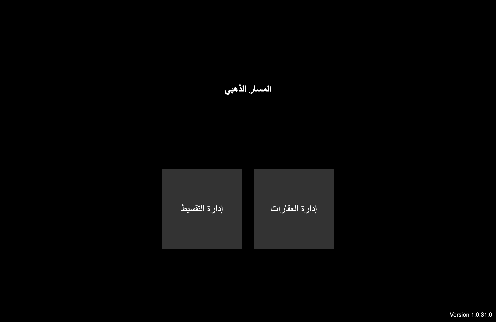
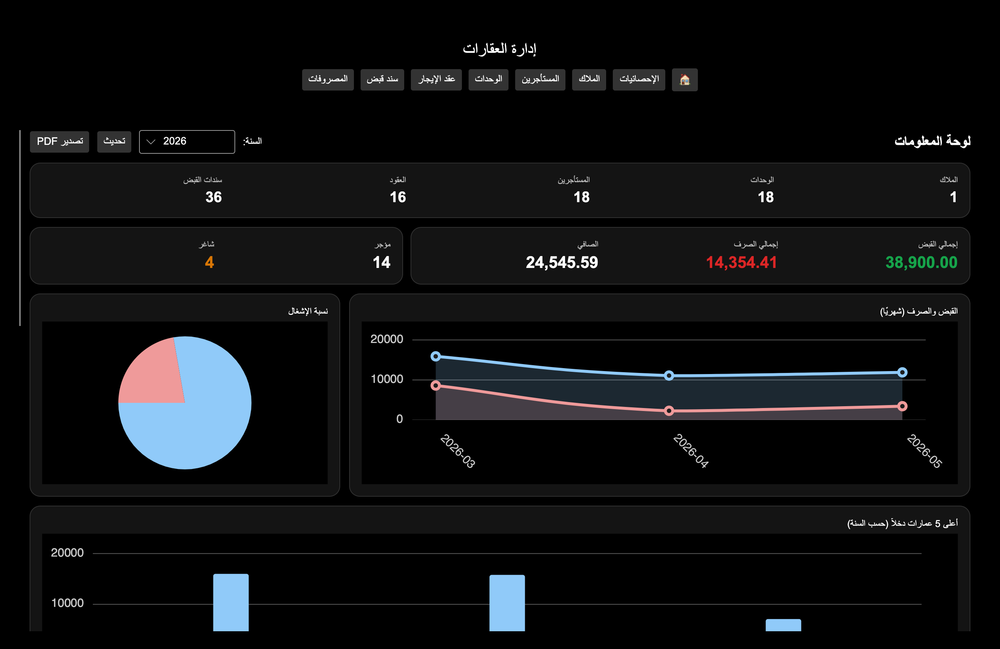
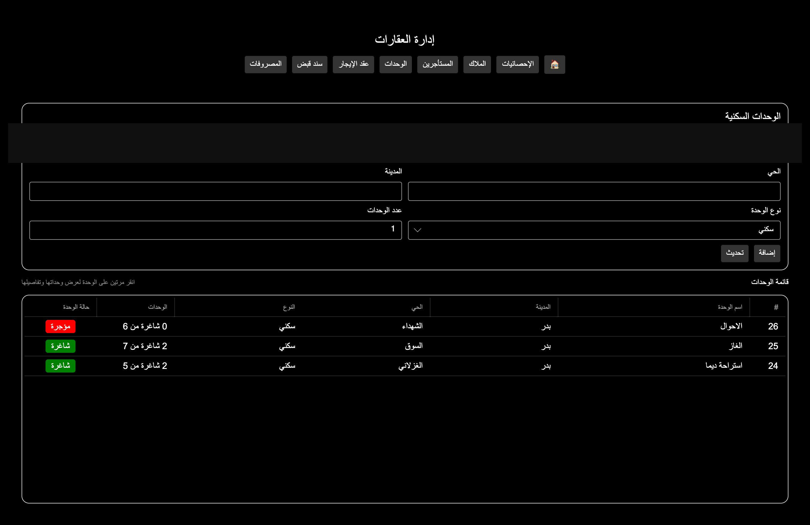
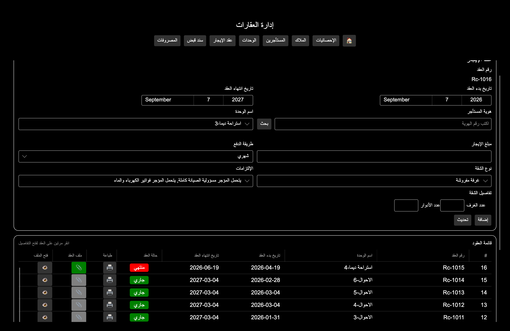
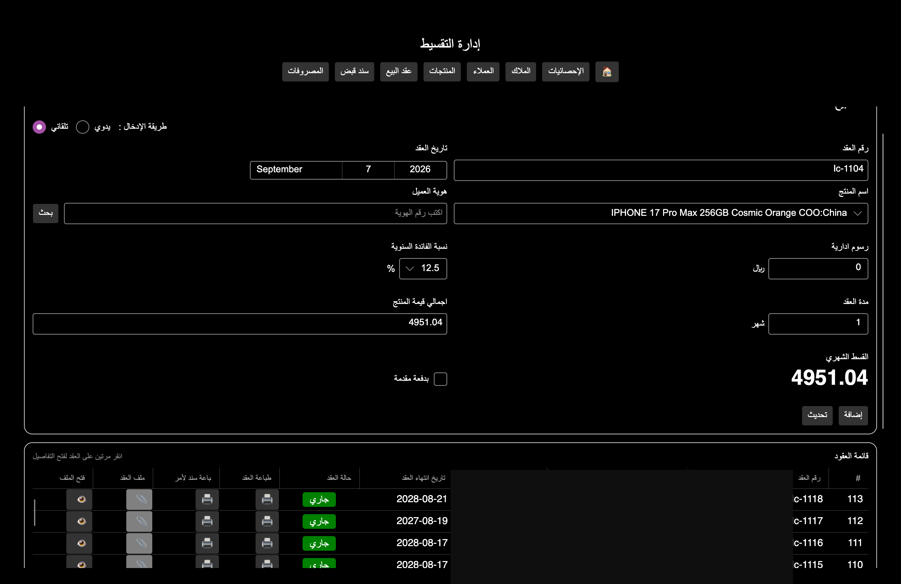
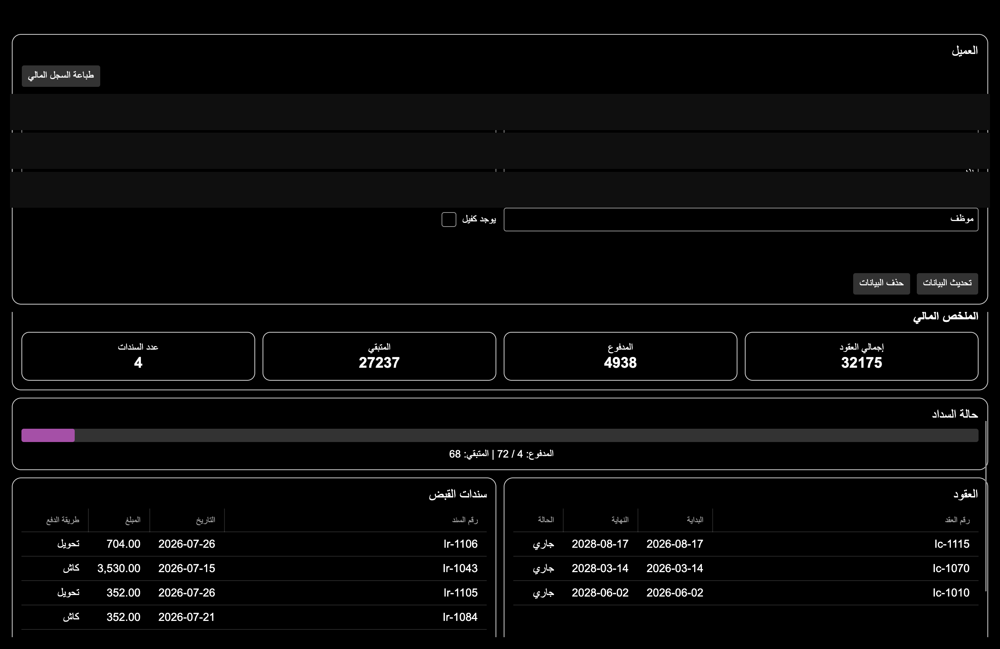
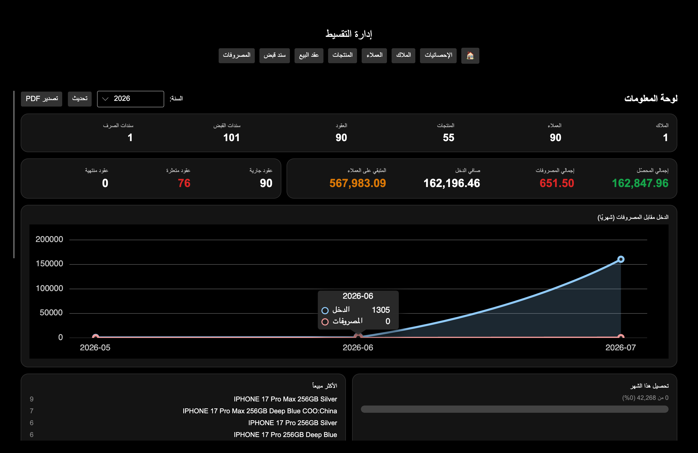

<div align="center">

# المسار الذهبي

**A Windows desktop application for managing real estate leases and installment sales contracts.**




</div>

---

## About

المسار الذهبي is a production desktop application, in daily use, that manages two related but distinct lines of business under one program. The interface is entirely in Arabic and right-to-left, including generated PDF documents.

It is **offline-first**: every feature works with no network connection, writing to a local SQLite database, and synchronises to Supabase when a connection is available. For a business where a dropped connection must never stop a contract from being written or a receipt from being issued, that isn't a convenience — it's the requirement the architecture is built around.



## The two modules

### Real estate

Owners hold units; units are leased to tenants under contracts; contracts generate receipts and carry expenses. Units track occupancy at the sub-unit level — a building of six apartments shows as **"2 vacant of 7"** rather than a single occupied flag, so a partly-let building is represented accurately.



Lease contracts record term dates, rent and payment schedule, furnishing type, obligations, and room and floor counts. Each contract has a live status — active or expired — derived from its dates, and supporting documents can be attached to the record.



### Installments

Owners, customers, products and sale contracts, with receipts against each contract. A contract takes the product price, an annual interest rate, administrative fees and a term, and computes the monthly instalment — with an optional down payment, and a manual override when a figure has to be set directly rather than derived.



Each customer has a financial file showing total contract value, paid and outstanding balances, a payment-progress bar, and full contract and receipt histories — printable as a statement.



## Dashboards

Both modules open on a dashboard with year-over-year filtering, exportable to PDF.



Real estate reports occupancy rate, income against expenses by month, and the highest-earning buildings. Installments report collected and outstanding totals, contracts in arrears, income against expenses, and best-selling products. Charts are drawn with LiveCharts.

## Documents

Contracts, receipts and financial statements are generated as PDF through **QuestPDF**, laid out right-to-left in Arabic — a separate problem from rendering Arabic on screen, and the harder of the two.

## Roles and access

Four roles — `admin`, `editor`, `viewer`, `tester` — separate read access from write access. Access control is enforced at the database through Supabase row-level security policies rather than only in the interface, so it holds regardless of which client is talking to the API.

## Sync model

Every local table carries three sync columns:

```sql
CloudId    INTEGER NOT NULL DEFAULT 0,
IsDirty    INTEGER NOT NULL DEFAULT 0,
SyncAction TEXT    NOT NULL DEFAULT ''
```

Local writes mark the row dirty with the action that caused it. When a connection is available, dirty rows are pushed and the flags cleared. Rows whose parent record hasn't reached the cloud yet are skipped and retried on the next pass rather than pushed with a dangling reference.

Full write-up: **[docs/ARCHITECTURE.md](docs/ARCHITECTURE.md)**

## Updates

Releases ship through **Velopack**, which builds the Windows installer and handles in-place updates, so machines already in the field move to a new version without a manual reinstall or losing local data.

## Problems worth reading about

Offline-first sync and why the dirty-flag model was chosen over the alternatives, Arabic right-to-left in generated PDF, and shipping updates to machines holding live business data:

**[docs/CHALLENGES.md](docs/CHALLENGES.md)**

## Built with

| | |
|---|---|
| **Avalonia UI 11.3** | Cross-platform .NET desktop UI |
| **.NET 10 / C#** | Runtime and language |
| **Microsoft.Data.Sqlite** | Local database |
| **Supabase** | Cloud sync, authentication, row-level security |
| **QuestPDF** | Arabic RTL document generation |
| **LiveChartsCore** | Dashboard charts |
| **Velopack** | Installer and auto-update |

## Building

```bash
git clone https://github.com/we-dad/RealstateApp.git
cd RealstateApp
dotnet restore
dotnet run
```

Requires the .NET 10 SDK. The local database is created on first run under the user's local application data folder. Cloud sync requires a Supabase project URL and publishable key in `Cloud/Services/SupabaseService.cs`, with row-level security policies configured on every table.

> **Note on the Supabase key.** Supabase publishable keys are designed to ship inside client applications and are not secrets; access is controlled by row-level security policies on the database, not by key secrecy.
